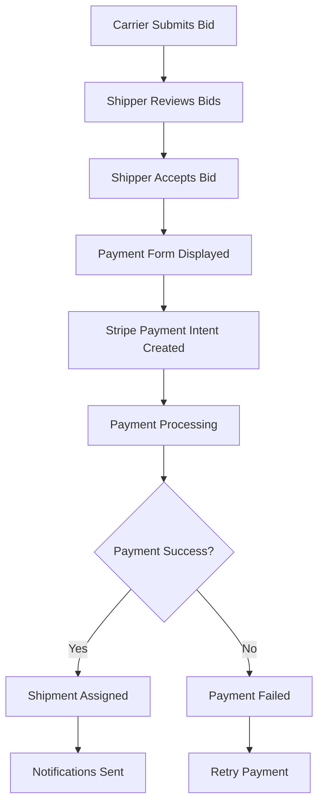

# 💳 FreightFloo Payment System Guide

## 🎯 Overview

FreightFloo includes a comprehensive payment system built with Stripe that handles:

- **Payment Processing**: Secure credit card payments for accepted bids
- **Refund Management**: Full and partial refunds with dispute handling
- **Security Features**: Rate limiting, fraud detection, and payment validation
- **Notifications**: Real-time email and in-app notifications
- **Webhook Integration**: Automatic payment status updates

## 🏗️ System Architecture

### Core Components

1. **Payment Form** (`components/PaymentForm.tsx`)

   - Stripe Elements integration
   - Real-time payment processing
   - Error handling and user feedback

2. **Refund System** (`components/RefundForm.tsx`)

   - Partial and full refund requests
   - Reason tracking and approval workflow
   - Automatic Stripe refund processing

3. **Payment Dashboard** (`app/payments/page.tsx`)

   - Payment history and status tracking
   - Refund request interface
   - Transaction management

4. **API Endpoints** (`app/api/payments/`)
   - `create-payment-intent`: Initialize payments
   - `complete`: Finalize payment processing
   - `webhook`: Handle Stripe events
   - `refunds`: Manage refund requests

## 🔧 Setup Instructions

### 1. Environment Configuration

Copy the environment variables from `env-payment-setup.txt` to your `.env.local`:

```env
# Stripe Configuration
STRIPE_SECRET_KEY=sk_test_your_stripe_secret_key_here
NEXT_PUBLIC_STRIPE_PUBLISHABLE_KEY=pk_test_your_stripe_publishable_key_here
STRIPE_WEBHOOK_SECRET=whsec_your_webhook_secret_here

# Email Configuration (for notifications)
RESEND_API_KEY=re_your_resend_api_key_here
```

### 2. Stripe Account Setup

1. **Create Stripe Account**: [dashboard.stripe.com](https://dashboard.stripe.com)
2. **Get API Keys**: Navigate to Developers → API Keys
3. **Set up Webhooks**:
   - Go to Developers → Webhooks
   - Add endpoint: `https://yourdomain.com/api/payments/webhook`
   - Select events: `payment_intent.succeeded`, `payment_intent.payment_failed`

### 3. Local Development

For local testing with webhooks:

```bash
# Install Stripe CLI
npm install -g stripe-cli

# Login to Stripe
stripe login

# Forward webhooks to local server
stripe listen --forward-to localhost:3000/api/payments/webhook
```

## 💰 Payment Flow

### 1. Bid Acceptance → Payment



### 2. Payment Processing Steps

1. **Payment Intent Creation**

   - Validates user permissions
   - Checks payment security
   - Creates Stripe Payment Intent
   - Stores payment record in database

2. **Payment Confirmation**

   - Processes payment with Stripe
   - Updates payment status
   - Assigns shipment to carrier
   - Sends notifications

3. **Webhook Processing**
   - Handles real-time payment events
   - Updates database automatically
   - Sends email notifications
   - Creates in-app notifications

## 🔒 Security Features

### Payment Security (`lib/payment-security.ts`)

1. **Account Validation**

   - Minimum account age (24 hours)
   - Email verification required
   - Carrier verification status

2. **Amount Limits**

   - Maximum payment: $10,000
   - Daily limit: $5,000
   - Rate limiting: 5 attempts per hour

3. **Fraud Detection**

   - Duplicate payment prevention
   - Failed payment monitoring
   - Suspicious activity logging

4. **Rate Limiting**
   - Prevents payment spam
   - Temporary blocks after failures
   - Automatic reset after cooldown

## 📧 Notification System

### Email Templates

The system sends automated emails for:

- **Payment Completed**: Confirmation to shipper
- **Shipment Assigned**: Notification to carrier
- **Payment Failed**: Error notification
- **Refund Processed**: Refund confirmation

### In-App Notifications

Real-time notifications for:

- Payment status updates
- Refund requests
- Security alerts
- System messages

## 🔄 Refund System

### Refund Types

1. **Full Refund**: Complete payment reversal
2. **Partial Refund**: Partial amount refund
3. **Dispute Refund**: Customer dispute resolution

### Refund Process

1. **Request Submission**

   - User selects refund amount
   - Provides reason and description
   - System validates eligibility

2. **Stripe Processing**

   - Automatic refund via Stripe API
   - Real-time status updates
   - Webhook event handling

3. **Status Updates**
   - Payment status: `REFUNDED`
   - Shipment status: `CANCELLED`
   - Notifications sent to all parties

## 🧪 Testing

### Test Cards

Use Stripe test cards for development:

```
Success: 4242 4242 4242 4242
Decline: 4000 0000 0000 0002
Insufficient Funds: 4000 0000 0000 9995
```

### Webhook Testing

```bash
# Test successful payment
stripe trigger payment_intent.succeeded

# Test failed payment
stripe trigger payment_intent.payment_failed

# Test dispute
stripe trigger charge.dispute.created
```

## 📊 Monitoring & Analytics

### Stripe Dashboard

Monitor:

- Payment success rates
- Failed payment reasons
- Webhook delivery status
- Refund processing times

### Application Logs

Track:

- Payment security violations
- Failed webhook deliveries
- Database transaction errors
- Email delivery status

## 🚀 Production Deployment

### Environment Setup

1. **Update Environment Variables**

   - Use live Stripe keys
   - Set production webhook URL
   - Configure email service

2. **Webhook Configuration**

   - Update endpoint URL
   - Verify SSL certificate
   - Test webhook delivery

3. **Security Checklist**
   - Enable HTTPS
   - Set up monitoring
   - Configure backup systems
   - Test disaster recovery

### Performance Optimization

1. **Database Indexing**

   - Payment status queries
   - User payment history
   - Webhook event processing

2. **Caching Strategy**
   - Payment status caching
   - User permission caching
   - Rate limit storage

## 🛠️ Troubleshooting

### Common Issues

1. **Payment Intent Creation Fails**

   - Check Stripe API keys
   - Verify user permissions
   - Review security checks

2. **Webhook Not Receiving Events**

   - Verify webhook URL
   - Check webhook secret
   - Test with Stripe CLI

3. **Refund Processing Errors**
   - Check payment status
   - Verify Stripe refund limits
   - Review dispute policies

### Debug Commands

```bash
# Check webhook status
stripe webhooks list

# View payment details
stripe payment_intents retrieve pi_xxx

# Test refund
stripe refunds create --payment-intent pi_xxx --amount 1000
```

## 📚 API Reference

### Payment Endpoints

#### `POST /api/payments/create-payment-intent`

Creates a new payment intent for a shipment.

**Request:**

```json
{
  "shipmentId": "string",
  "bidId": "string"
}
```

**Response:**

```json
{
  "clientSecret": "string",
  "paymentId": "string"
}
```

#### `POST /api/payments/complete`

Completes a payment and assigns shipment.

**Request:**

```json
{
  "paymentId": "string"
}
```

#### `POST /api/payments/webhook`

Handles Stripe webhook events.

### Refund Endpoints

#### `POST /api/refunds`

Creates a refund request.

**Request:**

```json
{
  "paymentId": "string",
  "amount": "number",
  "reason": "string",
  "description": "string"
}
```

#### `GET /api/refunds`

Retrieves user's refund history.

## 🔐 Security Best Practices

1. **Never store card details** - Use Stripe for all payment data
2. **Validate all inputs** - Sanitize user-provided data
3. **Use HTTPS** - Encrypt all payment communications
4. **Monitor transactions** - Set up fraud detection alerts
5. **Regular audits** - Review payment logs and security events

## 📞 Support

For payment system issues:

1. Check Stripe Dashboard for payment status
2. Review application logs for errors
3. Test with Stripe CLI for webhook issues
4. Verify environment variables are correct
5. Contact support with specific error messages

---

**Note**: This payment system is designed for freight marketplace transactions. Ensure compliance with local financial regulations and PCI DSS requirements for production use.
